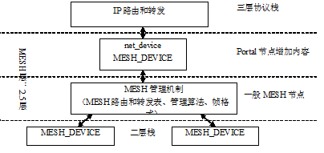

Portal节点net_device接口的设计与实现
######################################
李志杰 2006.09.20

MESH节点的分类和特点
========================
分为两类：

#. 一般的传输转发节点
#. 支持Portal的节点，包含一般节点的全部功能

特点：

一个Portal节点有且只有一个net_device设备，即只有唯一的一个三层的设备接口，所以net_device数据结构是与MESH节点相关的，而不是与某个MESH_DEVICE相关的

MESH节点的配置管理
=====================
* MESH节点在初始化时，即加载节点的驱动和MESH_DEVICE的驱动时，是不能确定节点是否为Portal节点的
* MESH节点成为Portal节点是动态地根据管理的需要而完成的，即：
   * 配置管理工具可以动态地把一个节点配置为Portal节点；
   * 配置管理工具也可以把一个Portal节点配置为一般的MESH节点；
   * MESH节点脚色的转换也可以根据路由算法以及网络拓扑管理的算法来自动地配置的

Portal节点数据报文的转发
===========================
数据转发的流程和软件框架
--------------------------
如下：
 

Device of Portal Node

所以：

Portal节点增加的部分

* 对于MESH机制而言，就是一种一般的MESH_DEVICE，有点类似IP协议栈的loopback类型的、虚拟的MESH_DEICE。这样，MESH管理机制并不区分这个虚拟接口和其他实际的二层实现的MESH_DEVICE的区别；实际的区别是由MESH的路由和转发算法来区别的，例如不同的MESH管理算法可以为这个设备分配不同的权值，以实现需要的路由管理功能。
* 对于IP三层，就是一个标准的net_device设备，和一般的net_device没有区别

这一部分需要实现的功能:

* 完成MESH数据帧向标准的ethernet帧的相互转换
* 与MESH管理机制接口的特殊功能（尚待定义）
* 互斥保护机制

