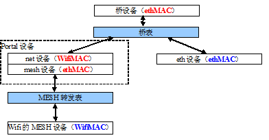
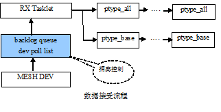
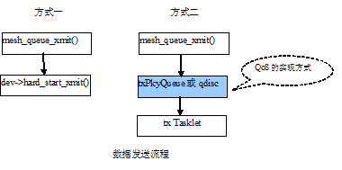

转发表与桥（桥表）

**注：**

* 蓝色黑体的MAC地址为设备实际的MAC地址
* 红色黑体的MAC地址为各虚拟设备指定的MAC地址
   * 其中portal设备的net侧设备的WifiMAC为该MP上第一个实际MESH设备的地址，也是该MP的主MAC地址

数据流程
========== 

Data Receiving Flow:

Data Transferring Flow:

 

madwifi中的QoS映射
----------------------

+------------------------+---------------------------+
|      802.11e           |           IP TOS          |
+========================+===========================+
|  Background（AC_BK）   |             20            |
|                        |             40            |
+------------------------+---------------------------+
|  Video（AC_VI）        |             80            |
|                        |             a0            |
+------------------------+---------------------------+
|  Voice（AC_VO）        |             c0            |
|                        |             e0            |
|                        |             88            |
|                        |             b8            |
+------------------------+---------------------------+
|     AC_BE              |            其他           |
+========================+===========================+

 
转发表的转发操作
-------------------

 .. image:: forwardingOp.png

